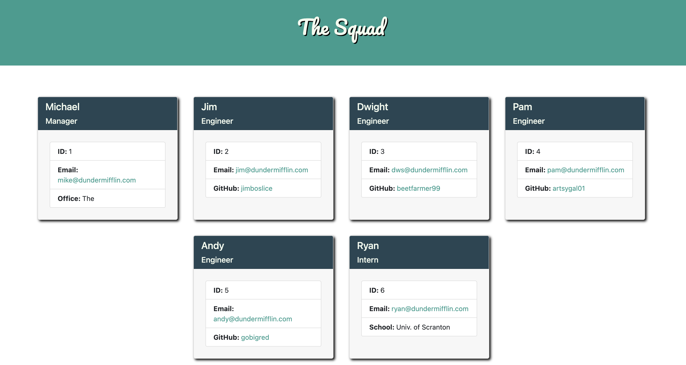

# team-profile-generator

## Description

This is my eighth homework assignment for the University of Denver Web Development Boot Camp! For this project, I was to build a command line application that dynamically generates a Team Profile HTML page based on user input. Additionally, in accordance with the principles of Test Driven Development (TDD), I was to build a comprehensive suite of tests using Jest to ensure the application functions as it should.  

This application was built using Javascript and Node.JS. It utilizes three Node modules - Inquirer, Jest, and FS. The user is asked for details of the Team Manager via Inquirer, and is then prompted to either add an Engineer, add an Intern, or generate team profile. They can add as many Engineers and Interns as they like! When they are finished, and select the Generate Team Profile option, the application then uses FS to generate an HTML file for their Team Profile, complete with all the team member details the user provided. Both the email address and GitHub username are functioning links (provided the user gave us proper email addresses / GitHub usernames, of course.)

Additionally, I built a suite of tests using Jest that ensure all components of the application are functioning properly.
  

## Installation

Because this project has several NPM dependencies, you will need to run the command 'npm i' before you execute the application itself.
  

## Testing

To run the tests I created for the project, simply enter 'npm run test' in the terminal (after installing NPM dependencies, of course!)
  

## Deployment

The code (and associated assets) are hosted right here in this GitHub repository. Because there isn't any kind of browser interface for this project, it's not hosted live on the web anywhere like my projects usually are. However, I did film a walk-through video that shows the functionality of the application. You can view that video here:

<a href="" target="blank"><b>Team Profile Generator Video Walk-Through</b></a>
  

## Credits

This project was made using Javascript and Node.JS. It relies on several NPM modules - Inquirer, Jest, and FS.
